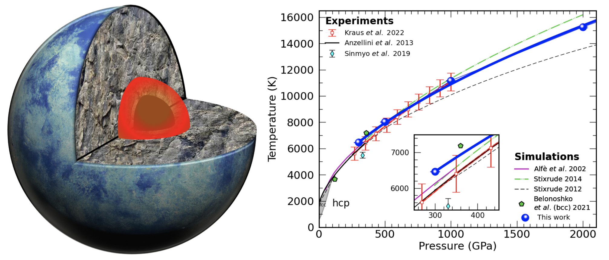
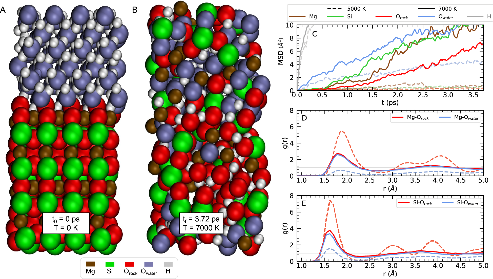
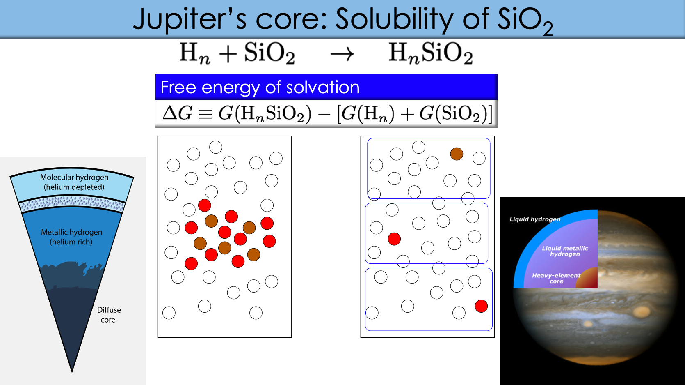
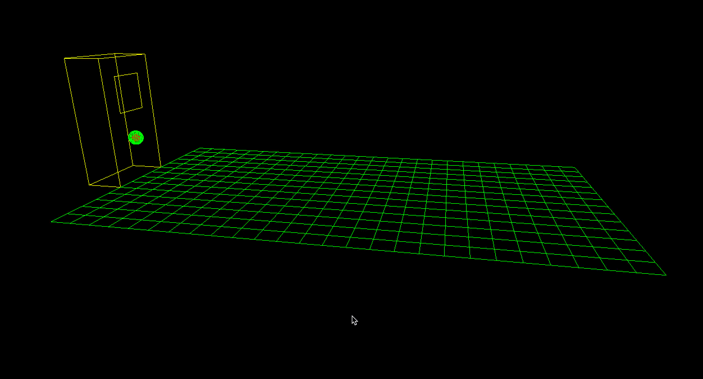
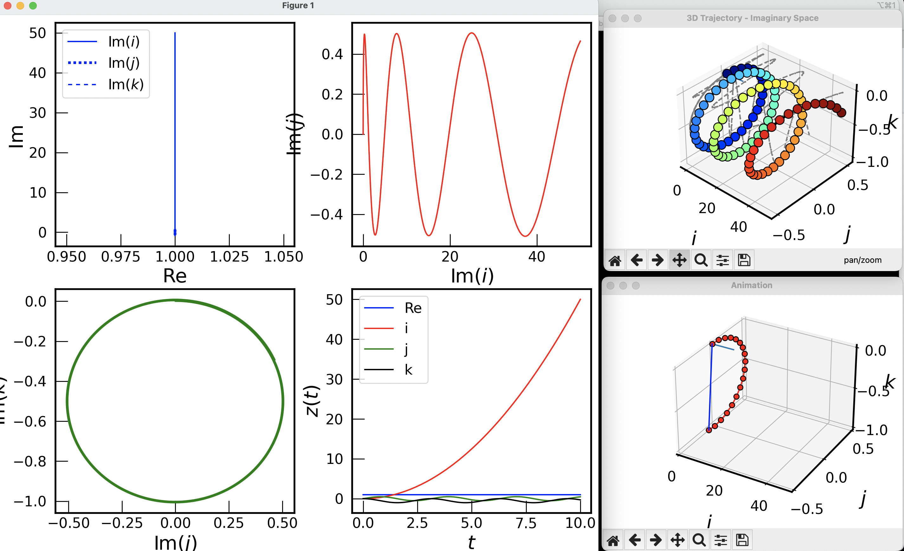

You'll find this post in your `_posts` directory - edit this post and re-build (or run with the `-w` switch) to see your changes!
To add new posts, simply add a file in the `_posts` directory that follows the convention: YYYY-MM-DD-name-of-post.ext.

Jekyll also offers powerful support for code snippets:


def print_hi(name)
  puts "Hi, #{name}"
end
print_hi('Tom')
#=> prints 'Hi, Tom' to STDOUT.


Check out the [Jekyll docs][jekyll] for more info on how to get the most out of Jekyll. File all bugs/feature requests at [Jekyll's GitHub repo][jekyll-gh].

[jekyll-gh]: https://github.com/mojombo/jekyll
[jekyll]:    http://jekyllrb.com

# Physicist

---
### Technical skills: C++, Python, Bash, awk, Mathematica, OpenGL

## Professional Experience 
[2021-present] Assistant Project Scientist, Department of Earth and Planetary Science, University of California, Berkeley (Burkhard Militzer's group)

[2016-2021] Postdoctoral Fellow, Department of Earth and Planetary Science, University of California, Berkeley (Burkhard Militzer's group)

## Education
[2009-2015] Ph.D.  Facultad de Ciencias, Universidad de Chile (Physics)

[2004-2009] B.S.   Facultad de Ciencias, Universidad de Chile (Physics)

----
## Research

    
    
    

----
## Projects
[See more projects](/projects) 

    
    
    

----
## Publications

### FPEOS
[Publication](https://doi.org/10.1103/PhysRevE.103.013203)

A database of equations of state derived from first principles for different materials and compounds. Allows the generation of of new EOS via the linear mixing approximation.

---

Page template forked from <a href="https://github.com/evanca/quick-portfolio">evanca</a>

<!-- Remove above link if you don't want to attibute -->

